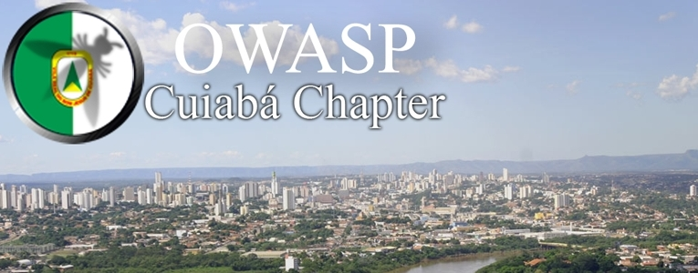

---

layout: col-sidebar
title: OWASP Cuiaba
tags: atividades-tag conectividade-tag  meeting-tag locais-tag patrocinadores-tag 
level: 0

region: South America

---
 

## Seja bem-vindo(a)!
Este é o capítulo OWASP em **Cuiabá/MT**.

O OWASP, sigla de Open Web Application Security Project, é uma organização internacional sem fins lucrativos destinada à transmissão de conhecimento e conscientização no que diz respeito à segurança de software, especialmente Web Security. Todos seus projetos, ferramentas, documentos, fóruns e capítulos são abertos à participação de qualquer pessoa interessada em melhorar a segurança de aplicações.

O município de Cuiabá esta Localizada no estado de Mato Grosso, Possui cerca de 556.298 habitantes, onde possui varias empresas de tecnologia e Universidades que apoiam crescimento tecnológico da Cidade. Visando este
crescimento foi criado Capitulo OWASP de Cuiabá, para conscientizar as pessoas envolvidas com tecnologia da informação , sobre a importância da segurança nas aplicações.

Os capítulos são liderados por líders locais, de acordo com o [Chapter Policy](https://owasp.org/www-policy/). Contribuições financeiras devem ser feitas apenas de maneira online usando o botão autorizado para doação online. Para se tornar um APRESENTADOR em QUALQUER capítulo do OWASP no mundo, simplesmente revise o [speaker agreement](https://owasp.org/www-policy/), e contacte o líder do capítulo local com detalhes sobre qual projeto, pesquisa independente, ou tópico relacionado à segurança de software você gostaria de apresentar.

Todos são encorajados a participar em nossos [Projetos](/projects), [Capítulos Locais](/chapters), [Eventos](/events), [Grupos Online](https://groups.google.com/a/owasp.com/){:target='_blank'}, e [Canal Slack da Comunidade](https://owasp.slack.com/){:target='_blank'}. Encorajamos especialmente a diversidade em todas as nossas iniciativas. O OWASP é um local fantástico para apresentar sobre segurança de aplicações, para fazer networking e até mesmo construir sua reputação como um especialista. Sinta-se também convidado a [se tornar um membro](/membership) ou considere uma [doação](/donate) para suportar nosso trabalho constante.

Happy Hacking!! :D 
