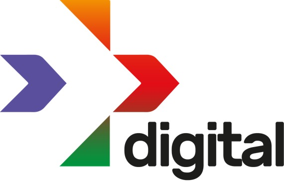

---

layout: col-sidebar
title: Sejam muito bem-vindos ao OWASP Day 2020
tags: owaspday2020-tag
level: 0

region: Latin America

---
 

## - O evento:  
Neste encontro iremos reunir vários especialistas para decorrer a temática de Direito Digital e Cibersegurança. 
Com a evolução da legislação brasileira e ferramentas de segurança da informação, como podemos integrar os mecanismos para a entrega de compliance nas organizações. 

A OWASP dispõe de ferramentas e metodologias importantes para auxiliar a entrega da conformidade e disponibilidade dos serviços de tecnologia da informação. Neste encontro você terá a oportunidade de conhecer "Papéis e Processos", "Ferramentas e Skills / Segurança", "Carreiras em Segurança da informação" e poder conversar com os os especialistas no assunto.

Este encontro será realizado pela Faculdade de Tecnologia SENAI-MT (FATEC) junto ao OWASP Chapter Cuiabá - MT, Conheça tambem as organicas que apoiam nosso encontro para fazer este dia muito especial. 

## - Programação:  

Dia 09/12 - Quarta-feira - Tema "Papéis e Processos" ( Mediadores: Eduardo Manzeppi & Ramicés dos Santos Silva )

- Wilson Leite Perito Criminal - Instituto Geral de Perícias [IGP/SC](https://www.igp.sc.gov.br). 
- Alessandra Monteiro Martins GPSC Consultant - Murah - DPO & CSO as a Service.
- Clariana Cardoso ( Clara ) -  IT Manager and Head of Innovation. 

Dia 10/12 - Quinta-feira - Tema "Ferramentas e Skills / Segurança ( Mediadores: Kembolle Amilkar & Abraão Nazário )

- Igor Serra Pereira - IT Infrastructure Supervisor at [Amaggi](https://www.amaggi.com.br).
- Joatham Pedro - Analista de Segurança da Informação at [4Linux](https://4linux.com.br) e Owner Canal [Qual teu papo?](https://www.youtube.com/c/QualTeuPapo).  
- Alvaro Viebrantz - Product Engineer at Leverege & Google Developer Expert for IoT. [DEVMT](https://github.com/devmatogrosso).

Dia 11/12- Sexta-feira - Tema "Carreiras" ( Mediadores: Luís Cézar Darienzo & Abraão Nazário )

- Dalmo Veras Neto - Chapter Leader [OWASP Florianópolis](https://owasp.org/www-chapter-florianopolis) - 313X Cyber Intelligence.
- Ricardo Alexandre Germano de Assis - Especialista técnico em redes na LogLab.
- Luís Cézar Darienzo Alves - PhD - Distributed Systems / System Engineering/ Security Information.
- Kembolle Amilkar  Chapter Leader [Owasp Cuiabá](https://owasp.org/www-chapter-cuiaba).
- Jonson Bonazza - Coordenador da LGPD no [Grupo Canopus](https://www.grupocanopus.com.br).

## - Período:   
09 á 11 de Dezembro de 2020 das 19 às 21hrs (Horário de Cuiabá - Mato Grosso).

## - Realização: 
 

## - Apoio: 
    

## - Observações:
- O evento será totalmente online e gratuito, transmitido pelo canal do YouTube da [FATEC SENAI- MT](https://www.youtube.com/c/FatecSenaiMatoGrosso)
- Ao final dos encontros realizaremos sorteios de brindes para a comunidade. Happy hacking !!! :D  

## - Inscrições: 
[https://lnkd.in/eTmCSVM](https://lnkd.in/eTmCSVM)